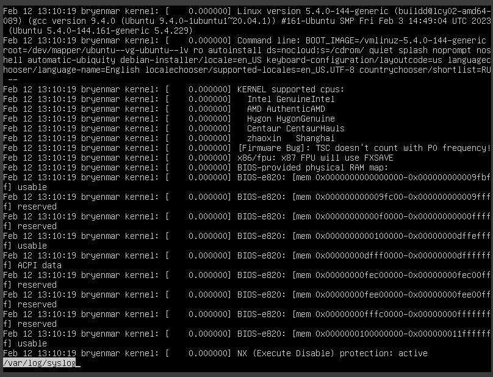

## Part 1. Установка ОС
Вывод версии Ubuntu: 

## Part 2. Создание пользователя
1. Создание нового пользователя: 
2. Добавление в группу: 
3. Вывод команды "cat /etc/passwd": 

## Part 3. Настройка сети ОС
1. Задаём название машины при помощи команды "sudo hostname user-1" или при помощи команды "sudo nano /etc/hostname" + пишем "user-1" + ^O + ^X.
2. Установка и проверка временной зоны: 
3. Вывод всех сетевых интерфейсов: 

Интерфейс lo (loopback) — это виртуальный сетевой интерфейс, который присутствует на большинстве операционных систем. Он используется для тестирования сетевых приложений и сервисов, а также для обеспечения доступа к локальной машине из сети.

Простыми словами, интерфейс lo позволяет компьютеру «увидеть» самого себя. Он позволяет отправлять и получать пакеты данных, которые не покидают компьютер. Стандартный IP-адрес для интерфейса lo — 127.0.0.1.

4. ip хоста: 

DHCP — сетевой протокол, позволяющий сетевым устройствам автоматически получать IP-адрес и другие параметры, необходимые для работы в сети TCP/IP.

5. ip-адрес внутреннего шлюза: 
6. ip-адрес внешнего шлюза: 
7. шлюзы после перезапуска виртуальной машины: 

## Part 4. Обновление ОС
1. Для обновления индекса пакетов или списка пакетов воспользуемся командой: "sudo apt update"
2. Для обновления пакетов воспользуемся командой: "sudo apt full-upgrade"

## Part 5. Использование команды sudo
1. Скрин с изменённым hostname: 

Sudo — это утилита для операционных систем семейства Linux, позволяющая пользователю запускать программы с привилегиями другой учётной записи, как правило, суперпользователя.

## Part 6. Установка и настройка службы времени
1. На скриншоте видно, что вывод команды timedatectl show содержит NTPSynchronized=yes, это соответствует требованию задания: 

## Part 7. Установка и использование текстовых редакторов
1. Выполним установку текстовых редакторов командами:
    "sudo apt install vim"
    "sudo apt install nano"
    "sudo apt install mcedit"

2. В VIM чтобы перейти в режим редактирования, нужно нажать клавишу i; чтобы выйти из VIM, нужно нажать "ESC" и написать ":wq": 

3. В NANO чтобы сохранить, жмём ^O; чтобы выйти, жмём ^X: 

4. В MCEDIT F10 для выхода:

5. В VIM чтобы выйти без сохранения, нужно нажать "ESC" и написать ":q!": 

6. В NANO чтобы выйти без сохранения, нужно нажать ^X и потом "N": 

7. В MCEDIT чтобы выйти без сохранения нужно нажать "F10" и выбрать "НЕТ": 

8. Для поиска в VIM нужно нажать "ESC" и написать "/"{искомое слово}: 

9. Для замены в VIM нужно нажать "ESC" и написать ":s/{что меняем}/{на что меняем}": 

10. Для поиска в NANO нужно нажать ^W и ввести слово: 

11. Для замены в NANO нужно нажать ^\: 

12. Для поиска в MCEDIT нужно нажать "F7": 

13. Для замены в MCEDIT нужно нажать "F4": 

## Part 8. Установка и базовая настройка сервиса SSHD
1. Установим службу SSHd с помощью команды: "sudo apt install openssh-server"

2. Узнаем состояние SSHd службы, воспользовавшись командой: "sudo systemctl status ssh"

3. Чтобы включить автостарт можно воспользоваться командой: "sudo systemctl enable ssh"

4. Для перенастройки службы SSHd на порт 2022 откроем файл sshd_config с помощью команды: "sudo nano /etc/ssh/sshd_config" и изменим значение параметра Port с 22 на 2022

5. Чтобы изменения в конфигурации сохранились, перезапустим сервер OpenSSH, используя следующую команду: "sudo systemctl restart ssh"

6. Проверим состояние SSHd службы после изменения порта командой: "sudo systemctl status ssh"

7. Заменим “ssh” новым номером порта: sudo ufw allow 2022/tcp: 

8. Покажем наличие процесса sshd, используя команду: ps aux | grep -i ssh

netstat - это утилита для мониторинга сетевых соединений, таблиц маршрутизации, статистики интерфейсов и других сетевых параметров.

• -t: этот параметр указывает netstat выводить только TCP-соединения. Если вы хотите увидеть только соединения по протоколу TCP, используйте этот флаг.

• -a: этот параметр указывает выводить все соединения и прослушиваемые порты. Это включает как активные соединения, так и те, которые находятся в состоянии ожидания (слушают).

• -n: этот параметр заставляет netstat выводить адреса и номера портов в числовом формате, а не разрешать их в имена хостов и сервисов. Это может ускорить вывод, особенно если DNS-серверы медленные или недоступны.

## Part 9. Установка и использование утилит top, htop

1. Вызов команды "top":

uptime: 20
количество авторизованных пользователей: 1
среднюю загрузку системы: 0
общее количество процессов: 0
загрузку cpu: 0,02%
загрузку памяти: 200,8 из 3919,0
pid процесса занимающего больше всего памяти: 1
pid процесса, занимающего больше всего процессорного времени: 1

2. Вывод по отсортированному PID, PERCENT_CPU, PERCENT_MEM, TIME:

3. Вывод по отфильтрованному для процесса sshd:

4. Вывод с процессом syslog, найденным, используя поиск:

5. Вывод с с добавленным выводом hostname, clock и uptime:

## Part 10. Использование утилиты fdisk
1. Команда "sudo fdsik -l":

Название жесткого диска: VBOX HARDDISK;
Размер диска: 25 Гигабайт;
Количество секторов: 52428800;

2. Размер с помощью команды "free -h"

## Part 11. Использование утилиты df
1. "df /":

Для корневого раздела (/):
Размер раздела: 11758760;
Размер занятого пространства: 5660032;
Размер свободного пространства: 5479620;
Процент использования: 51
Единицы измерения при выводе: Килобайты.

2. "df -Th":

Для корневого раздела (/):
Размер раздела: 12;
Размер занятого пространства: 5.4;
Размер свободного пространства: 5.3;
Процент использования: 51%;
Единицы измерения при выводе: Гигабайты

Тип файловой системы: Ext4 - журналируемая файловая система, используемая в ОС на ядре Linux. Основана на файловой системе Ext3, но отличается тем, что в ней представлен механизм записи файлов в непрерывные участки блоков (екстенты), уменьшающий фрагментацию и повышающий производительность. В ней есть журналирование, то есть в ней предусмотрена запись некоторых данных, позволяющих восстановить файловую систему при сбоях в работе компьютера.

## Part 12. Использование утилиты du
1. Команда "du":

2. Команды "sudo du -sh /home/", "sudo du -sh /var/", "sudo du -sh /var/log/": 

3. В человекочитаемом виде "/var/log/": 

## Part 13. Установка и использование утилиты ncdu
1. Команды "ncdu /home/", "ncdu  /var/", "ncdu  /var/log/":

## Part 14. Работа с системными журналами
1. Команда "less  /var/log/dmesg":

2. Команда "less  /var/log/syslog":

3. Команда "less  /var/log/auth.log":

Время последней успешной авторизации: Feb 12 18:54:21
Имя пользователя: usertwo
Метод входа в систему: by uid = 0

4. Для перезапуска SSHd: "sudo systemctl restart ssh"

5. Сообщение о перезапуске:

## Part 15. Использование планировщика заданий CRON
1. Используем планировщик заданий "CRON" в текстовом редакторе NANO: "crontab -e"

2. Добавим строчку в конец файла "*/2 * * * * uptime"

3. Найдем в системных журналах строчки о выполнении uptime: "less /var/log/syslog | grep CRON"

4. Выведем на экран список текущих заданий для CRON с помощью команды: "crontab -l"

5. Удалим все задания из планировщика заданий "CRON" с помощью команды: "crontab -r"

6. Проверим список текщих задач:
